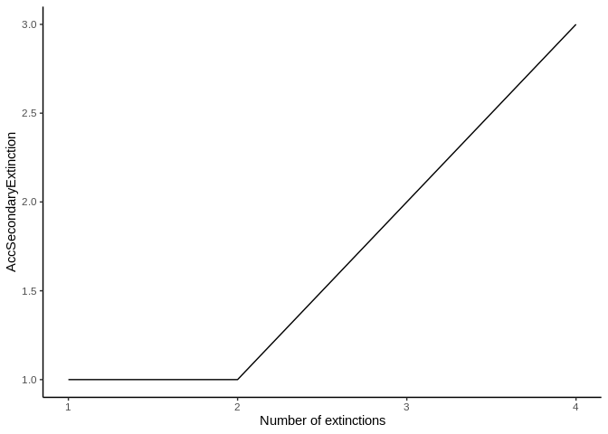
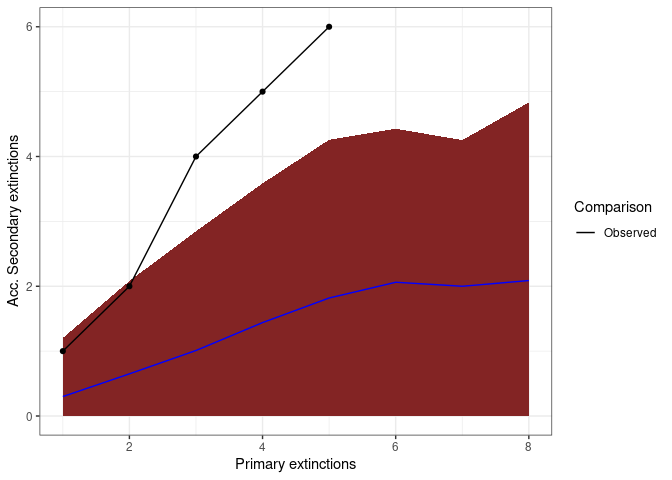
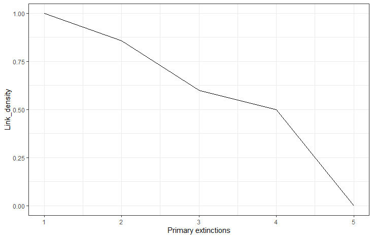
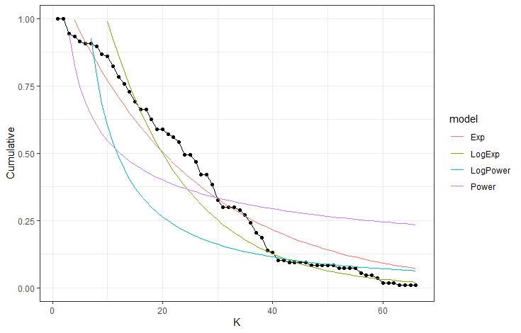
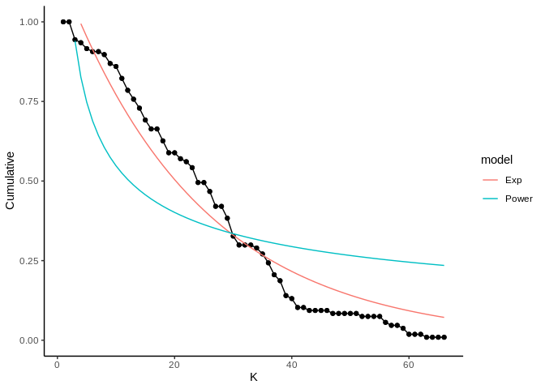

<!-- README.md is generated from README.Rmd. Please edit that file -->

# NetworkExtinction

<!-- badges: start -->

<!-- badges: end -->

The goal of NetworkExtinction is to Simulate the extinction of species
in the food web and to analyze its cascading effects, as described in
Dunne et al. (2002) 

## Installation

You can install the released version of NetworkExtinction from
[CRAN](https://CRAN.R-project.org) with:

``` r
install.packages("NetworkExtinction")
```

And the development version from [GitHub](https://github.com/) with:

``` r
# install.packages("devtools")
devtools::install_github("derek-corcoran-barrios/NetworkExtintion")
```

## Extinctions functions

### Extinctions from most to less conected species in the network

The *Mostconnected* function sorts the species from the most connected
node to the least connected node, using total degree. Then, it removes
the most connected node in the network, simulating its extinction, and
recalculates the topological indexes of the network and counts how many
species have indegree 0 (secondary extinction), not considering primary
producers. Then, it removes the nodes that were secondarily extinct in
the previous step and recalculates which node is the new most connected
species. This step is repeated until the number of links in the network
is zero (Sole and Montoya 2001; Dunne, Williams, and Martinez 2002;
Dunne and Williams 2009). In this new version it also calculates the
Predatory release.

``` r
library(NetworkExtinction)
data("net")
Mostconnected(Network = net)
```

    #> [1] 1
    #> [1] 2
    #> [1] 3
    #> [1] 4

| Spp | nodesS | linksS | Conectance | LinksPerSpecies | Secondary\_extinctions | Predation\_release | isolated\_nodes | AccSecondaryExtinction | NumExt | TotalExt |
| --: | -----: | -----: | ---------: | --------------: | ---------------------: | -----------------: | --------------: | ---------------------: | -----: | -------: |
|   6 |      9 |      7 |  0.0864198 |       0.7777778 |                      1 |                  0 |               1 |                      1 |      1 |        2 |
|   7 |      7 |      4 |  0.0816327 |       0.5714286 |                      0 |                  2 |               2 |                      1 |      2 |        3 |
|   5 |      6 |      2 |  0.0555556 |       0.3333333 |                      1 |                  3 |               3 |                      2 |      3 |        5 |
|   2 |      4 |      0 |  0.0000000 |       0.0000000 |                      1 |                  3 |               4 |                      3 |      4 |        7 |

Table 1: The resulting dataframe of the Mostconnected function

The result of this function is the dataframe shown in table 1. The first
column called *Spp* indicates the order in which the species were
removed simulating an extinction. The column *Secondary\_extinctions*
represents the numbers of species that become extinct given that they do
not have any food items left in the food web, while the
*AccSecondaryExtinction* column represents the accumulated secondary
extinctions. (To plot the results, see function *ExtinctionPlot*.)

``` r
data("net")
history <- Mostconnected(Network = net)
#> [1] 1
#> [1] 2
#> [1] 3
#> [1] 4
ExtinctionPlot(History = history, Variable = "AccSecondaryExtinction")
```



### Extinctions using a customized order

The *ExtinctionOrder* function takes a network and extinguishes nodes
using a customized order. Then, it calculates the topological network
indexes and the secondary extinctions.

``` r
data("net")
ExtinctionOrder(Network = net, Order = c(2,4,7))
```

| Spp | nodesS | linksS | Conectance | Secondary\_extinctions | Predation\_release | AccSecondaryExtinction | NumExt | TotalExt |
| --: | -----: | -----: | ---------: | ---------------------: | -----------------: | ---------------------: | -----: | -------: |
|   2 |      9 |      8 |  0.0987654 |                      1 |                  0 |                      1 |      1 |        2 |
|   4 |      7 |      5 |  0.1020408 |                      1 |                  0 |                      2 |      2 |        4 |
|   7 |      5 |      3 |  0.1200000 |                      0 |                  1 |                      2 |      3 |        5 |

Table 2: The resulting dataframe of the ExtinctionOrder
function


The results of this function are a dataframe with the topological
indexes of the network calculated from each extinction step (Table 2),
and a plot that shows the number of accumulated secondary extinctions
that occured with each removed node (Figure 4).

### Random extinction

The *RandomExtinctions* function generates n random extinction orders,
determined by the argument *nsim*. The first result of this function is
a dataframe (table 3). The column *NumExt* represents the number of
species removed, *AccSecondaryExtinction* is the average number of
secondary extinctions for each species removed, and
*SdAccSecondaryExtinction* is its standard deviation. The second result
is a graph (figure 5), where the x axis is the number of species removed
and the y axis is the number of accumulated secondary extinctions. The
solid line is the average number of secondary extinctions for every
simulated primary extinction, and the red area represents the mean
\(\pm\) the standard deviation of the simulations.

``` r
data(net)
RandomExtinctions(Network= net, nsim= 50)
```

| NumExt | SdAccSecondaryExtinction | AccSecondaryExtinction |
| -----: | -----------------------: | ---------------------: |
|      1 |                0.4184520 |               0.220000 |
|      2 |                0.7623808 |               0.520000 |
|      3 |                0.9691149 |               0.860000 |
|      4 |                1.0821370 |               1.180000 |
|      5 |                1.1383841 |               1.530612 |
|      6 |                1.1946852 |               1.933333 |
|      7 |                1.1407225 |               2.176471 |
|      8 |                1.0681880 |               1.846154 |
|      9 |                1.3038405 |               1.800000 |

Table 3: The resulting dataframe of the RandomExtinctions
function



\#\#\#Comparison of Null hypothesis with other extinction histories

The *RandomExtinctons* function generates a null hypothesis for us to
compare it with either an extinction history generated by the
*ExtinctionOrder* function or the *Mostconnected* function. In order to
compare the expected extinctions developed by our null hypothesis with
the observed extinction history, we developed the *CompareExtinctions*
function. The way to use this last function is to first create the
extinction history and the null hypothesis, and then the
*CompareExtinctins* function to compare both extinction histories.

``` r
data("net")
History <- ExtinctionOrder(Network = net, Order = c(1,2,3,4,5,6,7,8,9,10))

set.seed(2)
NullHyp <- RandomExtinctions(Network = net, nsim = 100)

Comparison <- CompareExtinctions(Nullmodel = NullHyp, Hypothesis = History)
```

The first result will be a graph (Figue 6) with a dashed line showing
the observed extinction history and a solid line showing the expected
value of secondary extinctions randomly generated.

The second result will be a Test object which will show the goodness of
fit statistics of the comparison. In this case, since the p value is
0.22 which is larger than 0.05, we consider that the generated
extinction history is significantly different than the null
hypothesis.



``` r
Comparison$Test
#> 
#>  Pearson's Chi-squared test
#> 
#> data:  Hypothesis$DF$AccSecondaryExtinction and Nullmodel$sims$AccSecondaryExtinction[1:length(Hypothesis$DF$AccSecondaryExtinction)]
#> X-squared = 20, df = 16, p-value = 0.2202
```

## Plotting the extinction histories of a network

The *ExtinctionPlot* function takes a NetworkTopology class object and
plots the index of interest after every extinction. By default, the
function plots the number of accumulated secondary extinctions after
every primary extinction (Figure 7), but any of the indexes can be
ploted with the function by changing the Variable argument (Figure 8).

``` r
data(net)
history <- Mostconnected(Network = net)
#> [1] 1
#> [1] 2
#> [1] 3
#> [1] 4
ExtinctionPlot(History = history)
```


``` r
ExtinctionPlot(History = history, Variable = "LinksPerSpecies")
```



## Degree distribution function

The *degree\_distribution* function calculates the cumulative
distribution of the number of links that each species in the food
network has (Estrada 2007). Then, the observed distribution is fitted to
the exponential, power law and truncated power law distribution models.

The results of this function are shown in figure 9 and table 4. The
graph shows the observed degree distribution in a log log scale fitting
the three models mentioned above, for this example we use an example
dataset of Chilean litoral rocky shores (Kéfi et al. 2015). The table
shows the fitted model information ordered by descending AIC, that is,
the model in the first row is the most probable distribution, followed
by the second an finally the third distribution in this case (Table 3),
the Exponential distribution would be the best model, followed by the
Power law and finally the Truncated power law model.

``` r
data("chilean_intertidal")
degree_distribution(chilean_intertidal, name = "Test")
```



|      logLik |          AIC |          BIC | model        | Normal.Resid |
| ----------: | -----------: | -----------: | :----------- | :----------- |
|   83.147529 | \-160.295059 | \-153.636536 | Exp          | No           |
|    5.420293 |   \-6.840586 |   \-2.461276 | Power        | No           |
|  \-9.281940 |    26.563879 |    35.322498 | LogTruncated | No           |
| \-27.482221 |    60.964443 |    67.533407 | LogExp       | No           |
| \-45.321942 |    94.643884 |    99.023194 | Truncated    | No           |
| \-80.841717 |   167.683433 |   174.252397 | LogPower     | No           |

Table 4: Model selection analysis

The main objective of fitting the cumulative distribution of the degrees
to those models, is to determine if the vulnerability of the network to
the removal of the most connected species is related to their degree
distribution. Networks that follow a power law distribution are very
vulnerable to the removal of the most connected nodes, while networks
that follow exponential degree distribution are less vulnerable to the
removal of the most connected nodes (Albert and Barabási 2002; Dunne,
Williams, and Martinez 2002; Estrada 2007; Santana et al. 2013).

# Bibliography

<div id="refs" class="references">

<div id="ref-albert2002statistical">

Albert, Réka, and Albert-László Barabási. 2002. “Statistical Mechanics
of Complex Networks.” *Reviews of Modern Physics* 74 (1). APS: 47.

</div>

<div id="ref-dunne2009cascading">

Dunne, Jennifer A, and Richard J Williams. 2009. “Cascading Extinctions
and Community Collapse in Model Food Webs.” *Philosophical Transactions
of the Royal Society B: Biological Sciences* 364 (1524). The Royal
Society: 1711–23.

</div>

<div id="ref-dunne2002food">

Dunne, Jennifer A, Richard J Williams, and Neo D Martinez. 2002.
“Food-Web Structure and Network Theory: The Role of Connectance and
Size.” *Proceedings of the National Academy of Sciences* 99 (20).
National Acad Sciences: 12917–22.

</div>

<div id="ref-estrada2007food">

Estrada, Ernesto. 2007. “Food Webs Robustness to Biodiversity Loss: The
Roles of Connectance, Expansibility and Degree Distribution.” *Journal
of Theoretical Biology* 244 (2). Elsevier: 296–307.

</div>

<div id="ref-kefi2015network">

Kéfi, Sonia, Eric L Berlow, Evie A Wieters, Lucas N Joppa, Spencer A
Wood, Ulrich Brose, and Sergio A Navarrete. 2015. “Network Structure
Beyond Food Webs: Mapping Non-Trophic and Trophic Interactions on
Chilean Rocky Shores.” *Ecology* 96 (1). Wiley Online Library: 291–303.

</div>

<div id="ref-de2013topological">

Santana, Charles N de, Alejandro F Rozenfeld, Pablo A Marquet, and
Carlos M Duarte. 2013. “Topological Properties of Polar Food Webs.”
*Marine Ecology Progress Series* 474: 15–26.

</div>

<div id="ref-sole2001complexity">

Sole, Ricard V, and M Montoya. 2001. “Complexity and Fragility in
Ecological Networks.” *Proceedings of the Royal Society of London B:
Biological Sciences* 268 (1480). The Royal Society: 2039–45.

</div>

</div>
