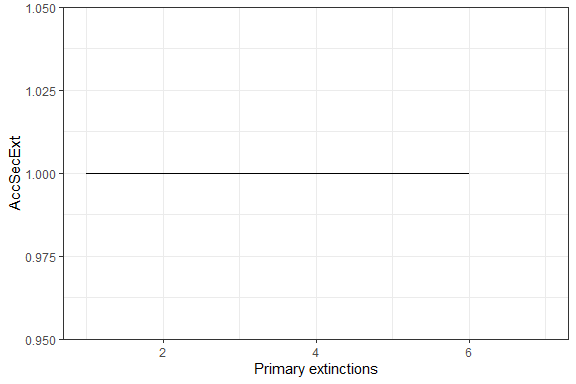
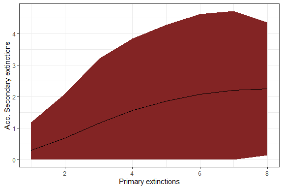
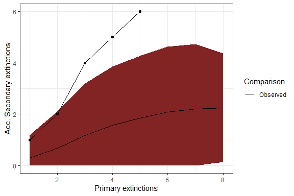
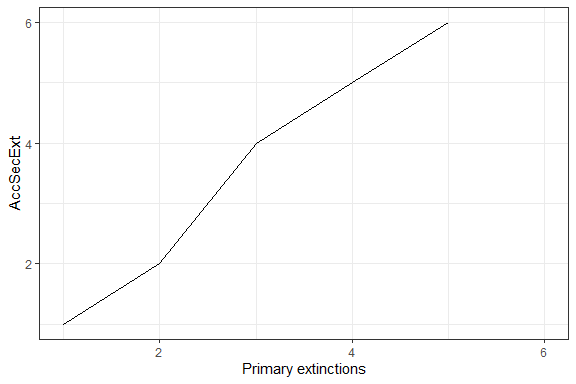
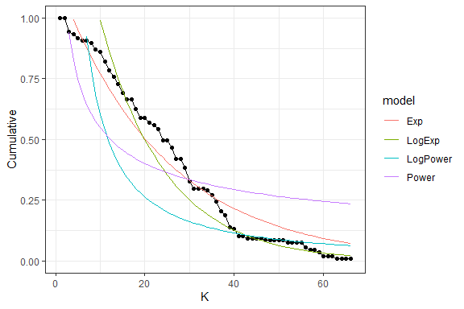

<!-- README.md is generated from README.Rmd. Please edit that file -->

# NetworkExtinction

# pkgdown 

<!-- badges: start -->

[](https://travis-ci.org/derek-corcoran-barrios/NetworkExtintion)
[](https://CRAN.R-project.org/package=NetworkExtinction)
[](https://www.tidyverse.org/lifecycle/#maturing)
[](https://cran.r-project.org/package=NetworkExtinction)
[](https://cran.r-project.org/package=NetworkExtinction)
[](https://codecov.io/gh/derek-corcoran-barrios/NetworkExtintion?branch=master)
[](https://github.com/derek-corcoran-barrios/NetworkExtintion/actions)
<!-- badges: end -->

The goal of NetworkExtinction is to Simulate the extinction of species
in the food web and to analyze its cascading effects, as described in
Dunne et al. (2002) 

## Installation

You can install the released version of NetworkExtinction from
[CRAN](https://CRAN.R-project.org) with:

``` r
install.packages("NetworkExtinction")
```

And the development version from [GitHub](https://github.com/) with:

``` r
# install.packages("devtools")
devtools::install_github("derek-corcoran-barrios/NetworkExtinction")
```

## Extinctions functions

### Extinctions from most to less conected species in the network

The `Mostconnected()` function sorts the species from the most connected node to the least connected node, using total degree. Then, it removes the most connected node in the network, simulating its extinction, and recalculates the topological indexes of the network and counts how many species have indegree 0 (secondary extinction), not considering primary producers. Then, it removes the nodes that were secondarily extinct in the previous step and recalculates which node is the new most connected species. This step is repeated until the number of links in the network is zero (Sole and Montoya 2001; Dunne, Williams, and Martinez 2002; Dunne and Williams 2009).

``` r
library(NetworkExtinction)
data("net")
SimulateExtinctions(Network = net, Method = "Mostconnected")
```

| Spp | S | L |         C | Link\_density | Modularity | SecExt | Pred\_release | Iso\_nodes | AccSecExt | NumExt | TotalExt |
| --: | -: | -: | ------: | ------------: |--------: | -----: | ------------: | ---------: | --------: | -----: | -------: |
|   6 | 9 | 7 | 0.0864198	|   0.7777778 	| 0.3163265|      1 |             0 |          1 |         1 |      1 |        2 |
|   7 | 7 | 4 | 0.0816327	|   0.5714286	  | 0.0000000|      0 |             2 |          2 |         1 |      2 |        3 |
|   5 | 6 | 2 | 0.0555556	|     0.3333333	| 0.0000000|      1 |             2 |          0 |         1 |      3 |        5 |
|   2 | 4 | 0 | 0.0000000	|     0.0000000	| 0.0000000|      1 |             3 |          0 |         1 |      4 |        7 |
|   1 | 2 | 0 | 0.0000000	|     0.0000000	|  NA      |      NA|             NA|          NA|         NA|      5 |        NA|

Table 1: The resulting dataframe of the Mostconnected function

The result of this function is a list which contains the dataframe shown in table 1. The first column called *Spp* indicates the order in which the species were removed simulating an extinction. The column *Secondary_extinctions* represents the numbers of species that become extinct given that they do not have any food items left in the food web, while the *AccSecondaryExtinction* column represents the accumulated secondary extinctions. (To plot the results, see function `ExtinctionPlot()`.)

``` r
data("net")
history <- SimulateExtinctions(Network = net, Method = "Mostconnected")
ExtinctionPlot(History = history[[1]], Variable = "AccSecExt")
```

<div class="figure">



<p class="caption">

Figure 3. The graph shows the number of accumulated secondary
extinctions that occur when removing species from the most to the least
connected species

</p>

</div>


In addition, the list returned by `SimulateExtinctions()` also contains the final Network that remains after all primary extinctions have been finished:

``` r
SimulateExtinctions(Network = net, Method = "Mostconnected")[[2]]
```


### Extinctions using a customized order

The `ExtinctionOrder()` function takes a network and extinguishes nodes using a customized order. Then, it calculates the topological network indexes and the secondary extinctions. In our toy network, nodes 1-4 are primary producers while nodes 9 and 10 represent apex predators. Let's see what happens when we sequentially remove all but the apex predators:

``` r
data("net")
SimulateExtinctions(Network = net, Order = 1:8, Method = "Ordered")
```

| Spp | S | L |         C | Link\_density | Modularity | SecExt | Pred\_release | Iso\_nodes | AccSecExt | NumExt | TotalExt |
| --: | -: | -: | --------: | ------------: | -------: | -----: | ------------: | ---------: | --------: | -----: | -------: |
|   1 |	9 |	9 |	0.1111111 |	1.0000000     |	0.2901235  |  1     |	0             |	0          |	1        |	1     |	2        |
|   2 |	7 |	6 |	0.1224490 |	0.8571429     |	0.0000000  |	1     | 0             |	0          |	2        |	2     |	4        |
|   3 |	5 |	3 |	0.1200000 |	0.6000000	    | 0.0000000  |	2     | 0             |	1          |	4        |	3     |	7        |
|   4 |	2 |	1 |	0.2500000 |	0.5000000	    | 0.0000000  |	1     | 0             |	0          |	5        |	4     |	9        |
|   5 |	1 |	0 |	0.0000000 |	0.0000000     |	0.0000000  |	1     | 0             |	1          |	6        |	5     |	11       |
|   6 |	6 |	0 |	0	        | NaN           |  	NA       |	NA    |	NA            |	NA         |	NA       |	6	    |NA        |

Table 2: The resulting dataframe of the ExtinctionOrder function

Already at the removal of node 5, we loose support for all other species in the network.

``` r
data("net")
Order <- SimulateExtinctions(Network = net, Order = 1:8, Method = "Ordered")
ExtinctionPlot(History = Order[[1]], Variable = "AccSecExt")
```
<div class="figure">

<p class="caption">

Figure 4. The graph shows the number of accumulated secondary extinctions that occur when removing species in a custom order.
</p>
</div>


The results of this function are a dataframe with the topological indexes of the network calculated from each extinction step (Table 2), and a plot that shows the number of accumulated secondary extinctions that occurred with each removed node (Figure 4).

### Random extinction

The `RandomExtinctions()` function generates n random extinction orders, determined by the argument `nsim`. The first result of this function is a dataframe (table 3). With the `SimNum` argument, you can control how many of the nodes in the network should be simulated to go extinct for each random extinction order. Here, we choose the same number as we set for our custom order example above.

The column *NumExt* represents the number of species removed, *AccSecondaryExtinction* is the average number of secondary extinctions for each species removed, and *SdAccSecondaryExtinction* is its standard deviation. The second result is a graph (figure 5), where the x axis is the number of species removed and the y axis is the number of accumulated secondary extinctions. The solid line is the average number of secondary extinctions for every simulated primary extinction, and the red area represents the mean $\pm$ the standard deviation of the simulations.

``` r
data(net)
set.seed(707)
RandomExtinctions(Network= net, nsim= 100, SimNum = 8)
```

<div class="figure">

<p class="caption">

Figure 5. The resulting graph of the RandomExtinctions function.
</p>
</div>

\#\#\#Comparison of Null hypothesis with other extinction histories

The `RandomExtinctons()` function generates a null hypothesis for us to compare it with either an extinction history generated by the `ExtinctionOrder()` function or the `Mostconnected()` function. In order to compare the expected extinctions developed by our null hypothesis with the observed extinction history, we developed the `CompareExtinctions()` function. The way to use this last function is to first create the extinction history and the null hypothesis, and then the `CompareExtinctions()` function to compare both extinction histories.

``` r
data("net")
Comparison <- CompareExtinctions(Nullmodel = Test, Hypothesis = Order)
```

The result will be a graph (Figue 6) with a dashed line showing the observed extinction history and a solid line showing the expected value of secondary extinctions randomly generated.

<div class="figure">

<p class="caption">

Figure 6. The resulting graph of the CompareExtinctions function, where the dashed line shows the observed extinction history, and a solid line shows the expected value of secondary extinctions originated at random.
</p>
</div>

## Plotting the extinction histories of a network

The `ExtinctionPlot()` function takes a NetworkTopology class object and plots the index of interest after every extinction. By default, the function plots the number of accumulated secondary extinctions after every primary extinction (Figure 7), but any of the indexes can be plotted with the function by changing the Variable argument (Figure 8).

``` r
data(net)
ExtinctionPlot(History = Order[[1]])
```

<div class="figure">

<p class="caption">

Figure 7. Example of the use of the ExtinctionPlot function showing the accumulated secondary extinctions against number of extinctions.
</p>
</div>

``` r
ExtinctionPlot(History = Order[[1]], Variable = "Link_density")
```

<div class="figure">

<p class="caption">

Figure 8. Another example of the use of the ExtinctionPlot function showing the number of links per species against number of extinctions.
</p>
</div>

## Degree distribution function

The `DegreeDistribution()` function calculates the cumulative distribution of the number of links that each species in the food network has (Estrada 2007). Then, the observed distribution is fitted to the exponential, and power law models.

The results of this function are shown in figure 9 and table 4. The graph shows the observed degree distribution in a log log scale fitting the three models mentioned above, for this example we use an example dataset of Chilean litoral rocky shores (Kéfi et al. 2015).
The table shows the fitted model information ordered by descending AIC, that is, the model in the first row is the most probable distribution, followed by the second an finally the third distribution in this case (Table 3), the Exponential distribution would be the best model, followed by the Power law model.

``` r
data("chilean_intertidal")
DegreeDistribution(chilean_intertidal)
```

<div class="figure">

<p class="caption">

Figure 9: Fitted vs observed values of the degree distribution. The black line and points show the observed values, the red, green and blue lines show the fitted values for the Exponential, power law and trucated distribution, respectively.
</p>
</div>

|     logLik |         AIC |         BIC | model    | Normal.Resid | family      |
| ---------: | ----------: | ----------: | :------- | :----------- | :---------- |
|   83.14753 | \-160.29506 | \-153.63654 | Exp      | No           | Exponential |
|   13.38647 |  \-20.77293 |  \-14.20397 | Power    | No           | PowerLaw    |
| \-27.48222 |    60.96444 |    67.53341 | LogExp   | No           | Exponential |
| \-80.84172 |   167.68343 |   174.25240 | LogPower | No           | PowerLaw    |

Table 4: Model selection analysis

The main objective of fitting the cumulative distribution of the degrees
to those models, is to determine if the vulnerability of the network to
the removal of the most connected species is related to their degree
distribution. Networks that follow a power law distribution are very
vulnerable to the removal of the most connected nodes, while networks
that follow exponential degree distribution are less vulnerable to the
removal of the most connected nodes (Albert and Barabási 2002; Dunne,
Williams, and Martinez 2002; Estrada 2007; Santana et al. 2013).

# Inter-Network Dependendancy

By default, the functions in *NetworkExtinction* assume that, for a secondary extinction to happen, a node needs to loose all connections to its prey (if `NetworkType == "Trophic"`) or all other nodes (if `NetworkType == "Mutualistic"`). 

One may also want to assume that species are only capable of sustaining existence given a threshold of remaining interaction strengths. This is implemented with the `IS` argument, with which one can either set a global node-dependency on interaction strengths or, alternatively, define an `IS` value for each node in the supplied network.

As a minimal example, let's consider primary extinctions of two of the producers in our toy network not taking into account any interaction strength loss thresholds:
``` r
IS_0 <- SimulateExtinctions(Network = net, Order = 1:2, Method = "Ordered")[[1]]
IS_0
```

| Spp | S | L |         C | Link\_density | Modularity | SecExt | Pred\_release | Iso\_nodes | AccSecExt | NumExt | TotalExt |
| --: | -: | -: | --------: | ------------: | -------: | -----: | ------------: | ---------: | --------: | -----: | -------: |
|   1 |	9 |	9 |	0.1111111 |	1.0000000     |	0.2901235  |  1     |	0             |	0          |	1        |	1     |	2        |
|   2 |	7 |	6 |	0.1224490 |	0.8571429     |	0.0000000  |	1     | 0             |	0          |	2        |	2     |	4        |

Table 5: The resulting dataframe of the basic version of SimulateExtinctions

As you can see, with the base version of `SimulateExtinctions()`, we obtain two secondary extinctions.

Now, let's consider that all our species in `net` need to retain a minimum of 70% of interaction strength to not go extinct (rather than a 0% as is the default):
``` r
IS_0.7 <- SimulateExtinctions(Network = net, Order = 1:2, Method = "Ordered", IS = 0.7)[[1]]
IS_0.7
```

| Spp | S | L |         C | Link\_density | Modularity | SecExt | Pred\_release | Iso\_nodes | AccSecExt | NumExt | TotalExt |
| --: | -: | -: | --------: | ------------: | -------: | -----: | ------------: | ---------: | --------: | -----: | -------: |
|   1 |	9 |	9 |	0.1111111 |	1.0000000     |	0.2901235  |  1     |	1             |	0          |	1        |	1     |	2        |
|   2 |	7 |	6 |	0.1224490 |	0.8571429     |	0.0000000  |	3     | 2             |	0          |	4        |	2     |	6        |

Table 6: The resulting dataframe of the interaction-strength loss version of SimulateExtinctions

As you can see, this drastically changes how many secondary extinctions we estimate.


# Rewiring Potential

Ecological networks aren't static and we should assume that species may shift their connections in response to extinctions of an association/interaction partner. Rewiring processes can be simulated with *NetworkExtinction* using the `Rewiring`, `RewiringDist`, and `RewiringProb` arguments.

Let's start with `RewiringDist`. This should be a matrix that contains information about similarities or rewiring potential of species indexed by columns to those indexed by rows. The package comes with an example data set for this:

``` r
data(dist)
```

This is a random distance matrix. For the sake of this example, we assume that these values represent probabilities of rewiring. We have to tweak it a bit to make it useful for our toy example of a trophic network, we do so by setting some of the values to 0:

``` r
dist[,1:4] <- 0 # producers don't worry about rewiring
dist[5:10,5:8] <- 0 # intermediate consumders can only rewire to producers
dist[c(1:4, 9:10), 9:10] <- 0 # apex predators can only rewire to intermediate consumers
```

This matrix makes a lot more sense for our purposes. To clarify once more how to read this data: species 8 (column) has a $.663$ chance of rewiring to species 2 (row).

Next, `Rewiring` is a function argument that, just like the `IS` argument can be set globally or individually for each node. It is used to calculate probabilities of rewiring from the data in `RewiringDist`. Since we assume `RewiringDist` to already contain probabilities in this example, we simply set `RewiringDist` to return the data without changing it:

``` r
RewiringDist <- function(x){x}
```

Lastly, `RewiringProb` is called upon to determine whether rewiring can happen among all potential rewiring partners. If no potential rewiring partner comes with a probability higher than this threshold, no rewiring happens. If multiple potential partners meet this threshold, rewiring happens only to the potential partner with the highest probability. Let's keep the default of 50% here.

Finally, let's out this all together with the `IS` example from above. Can we reduce the number of secondary extinctions when allowing for rewiring?

``` r
Rewiring <- SimulateExtinctions(Network = net, Order = 1:2, Method = "Ordered", IS = 0.7,
                              Rewiring = function(x){x}, RewiringDist = dist, RewiringProb = 0.5)[[1]]
Rewiring                              
```

| Spp | S | L |         C | Link\_density | Modularity | SecExt | Pred\_release | Iso\_nodes | AccSecExt | NumExt | TotalExt |
| --: | -: | -: | --------: | ------------: | -------: | -----: | ------------: | ---------: | --------: | -----: | -------: |
|   1 |	9 |	9 |	0.1111111 |	1.0000000     |	0.2901235  |  1     |	1             |	0          |	1        |	1     |	2        |
|   2 |	7 |	6 |	0.1224490 |	0.8571429     |	0.0000000  |	2     | 1             |	0          |	3        |	2     |	5        |

Table 7: The resulting dataframe of the rewiring version of SimulateExtinctions


Indeed, this made it so we have one less secondary extinction at the second primary extinction!

# Bibliography

<div id="refs" class="references">

<div id="ref-albert2002statistical">

Albert, Réka, and Albert-László Barabási. 2002. “Statistical Mechanics
of Complex Networks.” *Reviews of Modern Physics* 74 (1). APS: 47.

</div>

<div id="ref-dunne2009cascading">

Dunne, Jennifer A, and Richard J Williams. 2009. “Cascading Extinctions
and Community Collapse in Model Food Webs.” *Philosophical Transactions
of the Royal Society B: Biological Sciences* 364 (1524). The Royal
Society: 1711–23.

</div>

<div id="ref-dunne2002food">

Dunne, Jennifer A, Richard J Williams, and Neo D Martinez. 2002.
“Food-Web Structure and Network Theory: The Role of Connectance and
Size.” *Proceedings of the National Academy of Sciences* 99 (20).
National Acad Sciences: 12917–22.

</div>

<div id="ref-estrada2007food">

Estrada, Ernesto. 2007. “Food Webs Robustness to Biodiversity Loss: The
Roles of Connectance, Expansibility and Degree Distribution.” *Journal
of Theoretical Biology* 244 (2). Elsevier: 296–307.

</div>

<div id="ref-kefi2015network">

Kéfi, Sonia, Eric L Berlow, Evie A Wieters, Lucas N Joppa, Spencer A
Wood, Ulrich Brose, and Sergio A Navarrete. 2015. “Network Structure
Beyond Food Webs: Mapping Non-Trophic and Trophic Interactions on
Chilean Rocky Shores.” *Ecology* 96 (1). Wiley Online Library: 291–303.

</div>

<div id="ref-de2013topological">

Santana, Charles N de, Alejandro F Rozenfeld, Pablo A Marquet, and
Carlos M Duarte. 2013. “Topological Properties of Polar Food Webs.”
*Marine Ecology Progress Series* 474: 15–26.

</div>

<div id="ref-sole2001complexity">

Sole, Ricard V, and M Montoya. 2001. “Complexity and Fragility in
Ecological Networks.” *Proceedings of the Royal Society of London B:
Biological Sciences* 268 (1480). The Royal Society: 2039–45.

</div>

</div>
