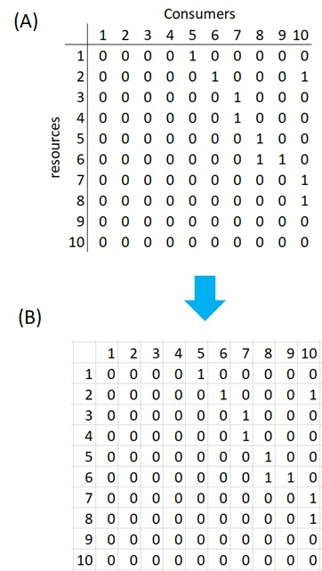

```{r setup, include = FALSE}
knitr::opts_chunk$set(
  collapse = TRUE,
  comment = "#>"
)
knitr::opts_chunk$set(fig.width=6, fig.height=4) 
```

#Introduction

The objective of the NetworkExtinction package is to analyze and visualize the topology of food-webs. While at the same time to analyze and visualize how food-webs respond to the simulated extinction of species.

The main indexes that are used for the analyzes are: 

1. Number of nodes: Total number of species in the network [@dunne2002food].

2. Number of links: Number of trophic relationships represented in the food web [@dunne2002food].

3. Connectance: Proportion of all possible trophic links that are actually realized [@dunne2002food].

4. Primary removals: Occurs when the researcher intentionally removes a species simulating an extinction.

5. Secondary extinctions: A secondary extinction occurs when a non-basal species loses all of its prey items, due to the removal of another species. In this context, basal species may experience primary removal, but not secondary extinctions [@dunne2002food].

6. Total extinctions: Primary removal plus secondary extinctions

This package was built with a total of six functions. Four of them are functions to analyze the cascading effect of extinctions in a food-web. One function to plot the results of any of the extinction analysis, and one function to analize the degree distribution of the networks

The functions to analyze the cascading effect of extinctions are:

* *Mostconnected:* To simulate extinctions from the most connected species to less connected species in the network.

* *ExtinctionOrder:* to simulate extinctions in a custom order.  

* *RandomExtinctions:* To develop a null hypothesis by generating random orders of simulated extinctions and average the results to find the expected results of random extinctions.

* *CompareExtinctions:* To compare the observed secondary extinctions, with the expected secondary extinction generated by random extinction.


The function to plot the results is:

* *ExtinctionPlot:* To plot the results of any of the extinction functions

The function to analize the degree distribution is:

* *degree_distribution:* The principal main is to observe if the vulnerability of the networks to the removal of the most connected species is related to their degree distribution. 

The literature associated the degree distribution of the networks with the vulnerability of them to the removal of the most connected nodes. Networks that follow power law distribution are very vulnerable to the removal of the most connected nodes, while networks that follow exponential degree distribution are also very vulnerable to the removal of the most connected nodes, but not as much as for power law networks [see @albert2002statistical, @dunne2002food, @estrada2007food, @de2013topological].


## How to install the package

```{r, eval=FALSE}
install.packages(NetworkExtinction)
library(NetworkExtinction)
```


## How to create a network object

NetworkExtinction package use a network object to make an analysis.  

For create a network object you can start with a matrix or a edgelist object (for more details see network package [@butts2008network]).

### The network example

As an example we will show how to build the following network:

 

This network is the network that we are using like a toy model for each example of this package.

The netowork is composed of a total of ten nodes and each node represent a species. Four nodes are basal species (primary producers, from sp.1 to sp.4), this means that each node have indegree = 0, outdegree = at least 1. Three nodes are intermediate (primary consumers, from sp.5 to sp.7), this means that each node have at least one indregre and one outdegree. Three are top predators (from sp.8 to sp.10), this means that each node have at least one indregre, but the outdegree = 0.


### How to build a network using a interaction matrix from excel 

In the matrices below, we show you how to build the matrix that represent throphic interactions (matrix A) in excel (matrix B).

In the matrices, the columns represents the consumers and the rows, the resources (see matrix A as example). Note that in the columns, the first 4 species have only zeros because they are not consumers

The matrices are binary, where:
1 represent a trophic interaction 
0 represent the absence of trophic interaction. 

To build the same matrix that we use in all the examples in this package, the matrix B is the matrix that we build in excel.



Finally, you need to import the matrix from excel to R. Here we show you how to import from excel.
Note that here we commented the code, because the import depends on where you directory are.

```{r}
##To import the matrix from excel:

#library(readxl)
#MatrixB <- read_excel(HERE YOU WRITE THE DIRECTORY WHERE YOU EXCEL MATRIX ARE)
#View(MatrixB)

##Once the matrix was already imported, you need to build a network object, to do this:

#library(network)
#net <- as.network(MatrixB, loops = TRUE)
#net 
```


### How to build a network using a interaction matrix from R 

If you want to build the matrix interaction with R, this is the form: 
```{r}
#To create the matrix a
a<- matrix(c(0,0,0,0,1,0,0,0,0,0,0,0,0,0,0,1,0,0,0,1,0,0,0,0,0,0,1,0,0,0,0,0,0,0,0,0,1,0,0,0,0,0,0,0,0,0,0,1,0,0,0,0,0,0,0,0,0,1,1,0,0,0,0,0,0,0,0,0,0,1,0,0,0,0,0,0,0,0,0,1,0,0,0,0,0,0,0,0,0,0,0,0,0,0,0,0,0,0,0,0), nrow=10, ncol=10)
a

#Note that, the previous matrix a, the consumers are in the rows and the resources in the columns. For this reason, you need to  transpose the matrix a. 

#To transpose, this is the form:
a<- t(a) #transpose matrix a
a

#Once the matrix is ready, you need to build a network object, to do this:
library(network)
net <- as.network(a, loops = TRUE)
net
```


# Functions

## Extinctions functions 

### Extinctions from most connected to less conected

The function to do this analysis is called *Mostconnected*

This function orders the species from the most connected node to the least connected node, using total degree. Then, remove the most connected node in the network and calculate the topological indexes of the network (which were mentioned above) and count how many species have indegree 0 (secondary extinction), without count primary producers. Then, remove the nodes that were secondarily extinct in the previous step and recalculate which is the new most connected node and so on, until the number of links in the network is zero [@sole2001complexity; @dunne2002food; @dunne2009cascading]

```{r}
library(NetworkExtinction)
data("net")
Mostconnected(Network = net)
```

The result is a dataframe. The first column (Spp) indicates which was the species that was removed as a primary removal. 

The column Secondary_extinctions represent the numbers of the species that are extinguished in a secondary form, and the AccSecondaryExtinction column represents the accumulated secondary extinction.

to plot the results, see function *ExtinctionPlot*
```{r, fig.cap="Fig 1. The graph shows the number of accumulated secondary extinctions that occur when removing species from the most connected to the least connected"}
data("net")
history <- Mostconnected(Network = net)
ExtinctionPlot(History = history, Variable = "AccSecondaryExtinction")

```


### Extinctions from custom order
The function to do this analysis is called *ExtinctionOrder*

It takes a network extinguishes nodes using a given order, then it calculates the topological network index and the secondary extinctions.

```{r}
data("net")
ExtinctionOrder(Network = net, Order = c(2,4,7))
```

The results it is a dataframe with the topological index of the network in each extinction step (like MostConnected results). Additionally, the result generate a plot that show the number of  accumulated secondary extinctions that occur when removing nodes

### Random extinction
The function to do this analysis is called *RandomExtinctions*
From a network, a certain amount of simulations is done (nsim), in which the species are removed in a random order.

the main of doing prymary removals randomly is to compare whether the number of secondary extinctions that occur when you remove nodes with a particular order (MostConnected or Extinctionorder) is different from the number of secondary extinctions that occur when executing primary removal orders in a random manner (To do this, see the function below *CompareExtinctions*).

```{r, message=FALSE}
data(net)
RandomExtinctions(Network= net, nsim= 50)
```

The result is a dataframe and a graph. 

*  In the dataframe,  The first column (NumExt) represents the number of extinction that occurs by primary removal. The second one, represents the deviation to the average of the accumulated secondary extinctions that occur when, independently of species identity, a certain number of species is extracted by primary removal. The third one, represents the average of the accumulated secondary extinctions that occur when, regardless of the specie identity, a certain number of species is extracted by primary removal.

*  In the graph, the figure shows the accumulated secondary extinction with their deviation (red shadow) that occur as the number of primary removal increases

###Comparison of Null hypothesis with other extinction histories

By using the *RandomExtincton* function, we create a null hypothesis for us to compare it with either an extinction history generated by the *ExtinctionOrder* function or the *Mostconnected* function. In order to compare the expected extinctions developed by our null hypothesis with the observed extinction history we developed the *CompareExtinctions* function.

The way to use this function is to first create the extinction history and the null hypothesis and then use the function to compare them:

```{r,message=FALSE, warning=FALSE}
data("net")
History <- ExtinctionOrder(Network = net, Order = c(1,2,3,4,5,6,7,8,9,10))

set.seed(2)
NullHyp <- RandomExtinctions(Network = net, nsim = 100)

Comparison <- CompareExtinctions(Nullmodel = NullHyp, Hypothesis = History)
```

the resulting object will have a graph with a dashed line showing the observed extinction history, and a solid line showing the expected value of secondary extinctions originated at random:

```{r}
Comparison$graph
```

We will also get a Test object which will show the goodness of fit statistics of the comparison:

```{r}
Comparison$Test
```

since the p value is `r round(Comparison$Test$p.value, 2)` which is larger than 0.05, we consider that the generated extinction history is significantly different than the null hypothesis.


## Plots of the extinctions history of a network function

The function to do this analysis is called *ExtinctionPlot*

It takes a NetworkTopology class object and plots the network index of interest after every extinction. By default, the function plot the numbers of accumulated secondary extinctions in function of each step of primary extinction.

```{r}
data(net)
history <- Mostconnected(Network = net)
ExtinctionPlot(History = history)

# To specify the variable to be ploted in the y axis, you need to
# add the name of the variable that you want plot
ExtinctionPlot(History = history, Variable = "LinksPerSpecies")

```


## Degree distribution function

The function to do this analysis is called *degree_distribution*

degree_distribution function calculate the cumulative distribution of the number of links that each species in the food network has [@estrada2007food]. Then, three expected distribution to the observed distribution, this are:
*  Exponential distribution model 
*  Power-law distribution model  
*  Truncated power-law distribution model  

At the same time, the degree_distribution function calculate the AIC to recognize among the three models mentioned above, which is the one that best fits to the observed distribution.

Finally, the degree_distribution function generate a plot of the observed degree distribution in a log-log scale fitting the three models mentioned above
```{r}
data("chilean_intertidal")
degree_distribution(chilean_intertidal, name = "Test")
```

The function generate three results:


1.  A list with the observed value of the network degree distribution (column K and Cumulative) and the expected values of the each fitting model (Exp = Exponential model, Power = Power-law model, truncated = Truncated Power-law model). k represent the degree of the network and cumulative the probability that each specie could be have this degree (pk).

2.  A list with the results if the AIC among the three models. In this case the model list are order from the best to the worst model.

3.  A Graph of the observed degree distribution with the fit of the three models.

*   OBSERVATION: In the graph, the zero values are not represented but this result are incorporate in the DDvalues result.

#Bibliography
